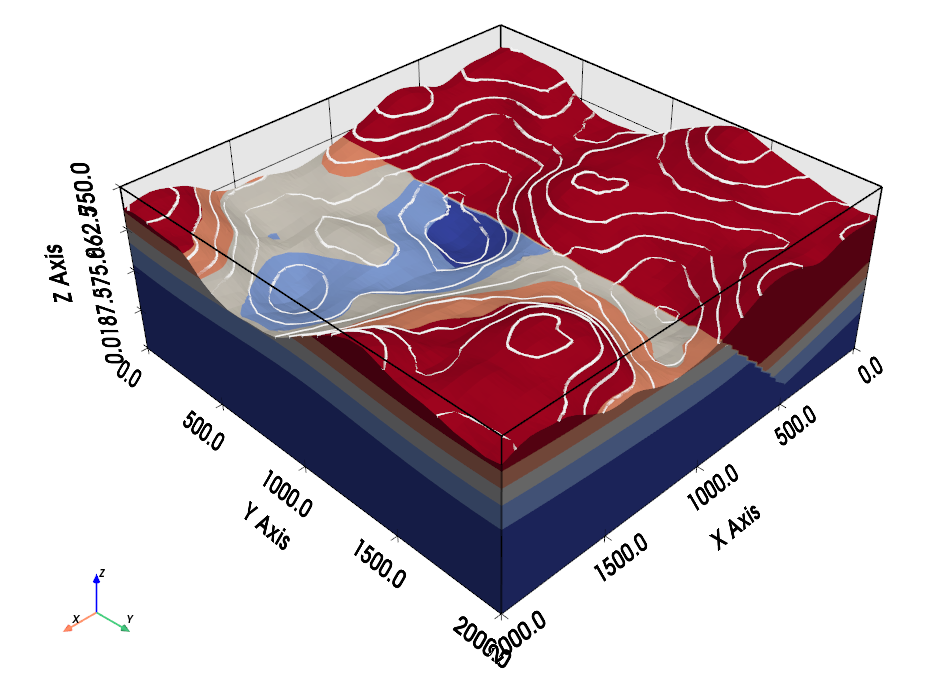

About
=====

Open-source software for implicit 3D structural geological modeling in Python.

Overview
--------

``GeoINR-faults`` is an extension of the ``GeoINR`` framework, designed to explore
and extend the capabilities of implicit neural representations for structural geology.

In addition to fault modeling, ``GeoINR-faults`` re-implements a substantial portion
of the core functionality of the original ``GeoINR`` framework, providing a unified
implementation for both standard ``GeoINR`` workflows and fault-related extensions.

``GeoINR-faults`` provides high-level model creation and compute APIs in
``geoinr_faults.api``, fault and stratigraphy feature construction, neural-network
solvers for implicit surfaces, and visualization helpers for model inspection.

3D models created with GeoINR may look like this:

Quickstart
----------

Quickly create a geological model with just 3 lines of code in GeoINR:

.. code-block:: python

   import geoinr_faults as inr

   # 1) Create model and load data
   model = inr.create_geomodel(
       project_name="HorizontalDemo",
       extent=[0, 2, 0, 1, 0, 1],
       resolution=[120, 80, 80],
       path_to_surface_points="examples/input_data/Horizontal_stratigraphy/horizontal_interface.csv",
       path_to_orientations="examples/input_data/Horizontal_stratigraphy/horizontal_orientation.csv",
   )

   # 2) Build stratigraphic stacks
   model = inr.add_stratis(
       model,
       strati_configs=[
           inr.StratiConfig(name="main", formations=["rock2", "rock1"]),
       ],
   )

   # 3) Train and predict
   model = inr.compute_model(model)

   # 4) Visualize
   inr.plot_model(model)

Features
--------

Geological Features
^^^^^^^^^^^^^^^^^^^

``GeoINR-faults`` is capable of modeling complex 3D geological scenarios, including:

* Multiple conformal layers (e.g. sequences of sedimentary layers)
* Folds (affecting single layers or entire layer stacks, including overturned and recumbent folds)
* Faults (offset calculated automatically from affected geological objects)
* Full fault networks (faults affecting faults)
* Unconformities (coming soon)

Combining these elements in ``GeoINR-faults`` allows for the generation of realistic
3D geological models, on a par with most commercial geomodeling software.

Interpolation Approach
^^^^^^^^^^^^^^^^^^^^^^

The generation of complex structural settings is based on the INR-based geological
modeling framework proposed by Hillier et al. (2023) and extended by Gao et al. (2025)
for fault modeling. The output of this geological modeling framework is a 3D scalar
field, such that geologically significant interfaces are isosurfaces in this field.

The algorithm allows for a direct integration of two of the most relevant geological
input data types:

* **Surface contact points**: 3D coordinates of points marking the boundaries
  between different features (e.g. layer interfaces, fault planes, unconformities).
* **Orientation measurements**: Orientation of the poles perpendicular to the
  dipping of surfaces at any point in 3D space.

References
----------

* Hillier, M., Wellmann, F., de Kemp, E. A., Brodaric, B., Schetselaar, E., & Bedard, K. (2023).
  `GeoINR 1.0: an implicit neural network approach to three-dimensional geological modelling <https://doi.org/10.5194/gmd-16-6987-2023>`_.
  Geoscientific Model Development, 16(23), 6987-7012.
* Gao, K., & Wellmann, F. (2025).
  `Fault representation in structural modelling with implicit neural representations <https://doi.org/10.1016/j.cageo.2025.105911>`_.
  Computers & Geosciences, 199, 105911.

See :doc:`examples/index` for notebook-based examples and :doc:`api/index`
for the full API reference.
